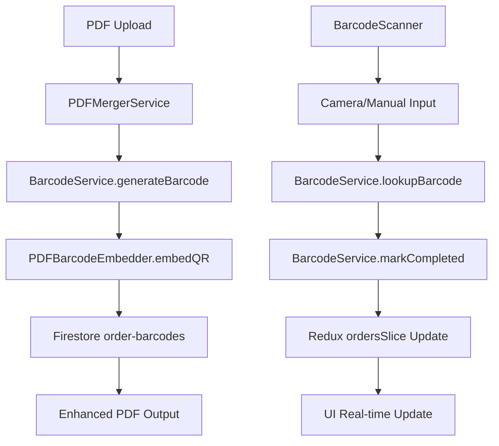

# Design Document

## Overview

The Barcode Order Completion feature extends the existing PDF processing pipeline to generate unique QR codes during order processing, embed them into printed labels, and provide camera-based scanning for instant order completion tracking. This design leverages Sacred Sutra Tools' existing architecture patterns while adding minimal complexity to the proven PDF processing and order management systems.

The feature operates through four main components: BarcodeService for code generation and tracking, PDF embedding utilities for QR integration, BarcodeScanner component for camera-based scanning, and enhanced UI components for completion status display. All components follow the established service layer separation and component-based architecture.

## Steering Document Alignment

### Technical Standards (tech.md)
This design follows all documented technical patterns:

- **TypeScript 5.7.3 with strict mode**: All new components use comprehensive TypeScript interfaces with strict null checks and proper type guards
- **Firebase 11.6.1 integration**: BarcodeService extends the established FirebaseService base class pattern used throughout the application
- **React 18 functional components**: Scanner component uses modern React patterns with hooks, following the established component architecture
- **Material-UI design system**: All UI enhancements use MUI components consistent with existing CategoryGroupedTable and ModernFilters patterns
- **Redux Toolkit state management**: Order completion status integrates with existing ordersSlice patterns and selectors
- **Service layer separation**: Business logic isolated in BarcodeService, no direct Firebase calls in UI components

### Project Structure (structure.md)
The implementation follows project organization conventions:

- **Feature-based structure**: Barcode components located in `src/pages/todaysOrders/components/` following existing patterns
- **Service layer**: BarcodeService in `src/services/` directory extending FirebaseService base class
- **Type definitions**: Barcode interfaces in `src/types/barcode.ts` following domain-specific type organization
- **Utility modules**: PDF embedding utilities in `src/utils/` for focused, single-purpose modules
- **Test colocation**: Component tests alongside source files in `__tests__/` directories

## Code Reuse Analysis

### Existing Components to Leverage
- **FirebaseService**: Base class with common Firestore operations, error handling, and data validation patterns
- **PDFMergerService**: Existing PDF processing pipeline that will be extended with barcode generation hooks
- **CategoryGroupedTable**: UI patterns for status indicators and real-time updates will be reused for completion badges
- **ModernFilters**: Filter component architecture will be extended with completion status filters
- **DataTable component**: Existing table patterns for displaying order data with additional completion columns

### Integration Points
- **PDF Processing Pipeline**: `src/pages/home/services/merge.service.ts` (lines 86-105, 134, 163) for barcode generation during order processing
- **Today's Orders Interface**: `src/pages/todaysOrders/todaysOrder.page.tsx` for scanner integration and status display
- **Redux State Management**: `src/store/slices/ordersSlice.ts` for completion status tracking and filtering
- **Firestore Database**: New `order-barcodes` collection following existing collection patterns with proper indexing

## Architecture

The barcode system uses a dual-storage approach for optimal performance: a dedicated `order-barcodes` collection for fast scanning lookups and embedded completion status in existing `active-orders` for UI consistency. This design ensures minimal changes to existing order management while providing efficient barcode scanning.

### Modular Design Principles
- **Single File Responsibility**: BarcodeService handles only barcode operations, PDFBarcodeEmbedder handles only PDF manipulation, BarcodeScanner handles only scanning interface
- **Component Isolation**: Scanner component is self-contained with clear props interface and no external dependencies beyond barcode service
- **Service Layer Separation**: All Firebase operations isolated in BarcodeService, UI components receive data through props and callbacks
- **Utility Modularity**: PDF embedding functionality separated into focused utility with specific QR code generation and positioning logic



## Components and Interfaces

### BarcodeService
- **Purpose:** Manages barcode generation, storage, and completion tracking with Firebase integration
- **Interfaces:** 
  - `generateBarcodeId(date: string): Promise<string>` - Creates unique barcode with collision detection
  - `createBarcodeRecord(data: OrderBarcode): Promise<void>` - Stores barcode tracking data
  - `lookupBarcode(barcodeId: string): Promise<OrderBarcode | null>` - Fast barcode lookup for scanning
  - `markOrderCompleted(barcodeId: string, userId: string): Promise<void>` - Updates completion status
- **Dependencies:** FirebaseService base class, Firestore collections
- **Reuses:** FirebaseService error handling, document operations, and validation patterns

### PDFBarcodeEmbedder
- **Purpose:** Handles QR code generation and PDF embedding with optimal positioning
- **Interfaces:**
  - `generateQRCodeImage(barcodeId: string): Promise<Uint8Array>` - Creates QR code image data
  - `embedBarcodeIntoPage(page: PDFPage, barcodeId: string): Promise<void>` - Embeds QR at bottom-left position
  - `calculateOptimalSize(pageSize: { width: number, height: number }): number` - Determines minimum viable QR size
- **Dependencies:** pdf-lib, jsbarcode
- **Reuses:** Existing PDF processing patterns from merge.service.ts

### BarcodeScanner
- **Purpose:** Provides camera-based QR scanning with manual entry fallback
- **Interfaces:**
  - Props: `{ onOrderCompleted: (barcodeId: string) => void, onError: (error: string) => void }`
  - State: Scanner active status, camera permissions, scanning results
- **Dependencies:** qr-scanner library, Material-UI components
- **Reuses:** Modal patterns from FilesModal, button styles from ModernFilters, responsive design from existing components

### Enhanced OrdersSlice
- **Purpose:** Extends existing Redux slice with completion status management
- **Interfaces:**
  - `markOrderCompleted` thunk for optimistic UI updates
  - `selectCompletedOrders`, `selectPendingOrders` selectors
  - `selectCompletionStats` for analytics display
- **Dependencies:** Existing ordersSlice structure, BarcodeService
- **Reuses:** Current async thunk patterns, selector creation patterns, filter logic

## Data Models

### OrderBarcode (New Collection)
```typescript
interface OrderBarcode {
  // Document ID: barcodeId (e.g., "BC_2024-01-15_001")
  barcodeId: string;           // Unique identifier for QR code
  dateDocId: string;           // Reference to active-orders document
  orderIndex: number;          // Position in orders array (0-based)
  orderId?: string;            // Original order ID if available
  isCompleted: boolean;        // Master completion status
  completedAt?: string;        // ISO timestamp when completed
  completedBy?: string;        // User ID who completed order
  
  // Order metadata for quick scanning reference
  metadata: {
    productName: string;       // Product name for scanning confirmation
    sku?: string;              // Product SKU for validation
    quantity: number;          // Order quantity
    platform: 'amazon' | 'flipkart';
    generatedAt: string;       // ISO timestamp when barcode created
  };
}
```

### Enhanced ActiveOrder (Existing Collection Extended)
```typescript
interface ProductSummary {
  // Existing fields...
  name: string;
  quantity: string;
  SKU?: string;
  orderId?: string;
  type: 'amazon' | 'flipkart';
  
  // NEW: Barcode completion fields
  barcodeId?: string;          // Link to barcode document
  isCompleted?: boolean;       // Synced completion status
  completedAt?: string;        // Synced completion timestamp
}
```

## Error Handling

### Error Scenarios
1. **Barcode Generation Failure:** PDF processing collision or Firestore write failure
   - **Handling:** Log error, continue processing other orders, generate alternative ID
   - **User Impact:** Warning notification but PDF processing continues

2. **QR Code Embedding Failure:** PDF manipulation error or memory constraints
   - **Handling:** Skip QR for affected page, log error, continue with remaining pages
   - **User Impact:** PDF generated without QR codes but order processing continues

3. **Camera Access Denied:** User denies camera permissions or device incompatibility
   - **Handling:** Automatic fallback to manual barcode entry interface
   - **User Impact:** Manual input option with clear instructions

4. **Invalid Barcode Scanned:** Non-existent or malformed barcode ID
   - **Handling:** Display user-friendly error message, clear scanning state
   - **User Impact:** Clear feedback with option to try again or enter manually

5. **Network Failure During Scanning:** Firestore unavailable during lookup
   - **Handling:** Queue completion for retry, show offline indicator
   - **User Impact:** Pending status with retry option when connection restored

## Testing Strategy

### Unit Testing
- **BarcodeService**: Test unique ID generation, collision detection, database operations
- **PDFBarcodeEmbedder**: Test QR generation, positioning calculations, PDF manipulation
- **BarcodeScanner**: Test scanning state management, error handling, user interactions
- **Redux Integration**: Test completion status updates, selector functions, optimistic updates

### Integration Testing
- **PDF Processing Flow**: End-to-end PDF upload with barcode generation and embedding
- **Scanning Workflow**: Complete scan-to-completion flow with database updates
- **UI State Synchronization**: Real-time updates between scanning and order display
- **Cross-browser Compatibility**: Camera functionality across Chrome, Firefox, Safari, Edge

### End-to-End Testing
- **Complete User Journey**: Upload PDF → Generate barcodes → Print → Scan → View completion status
- **Error Recovery**: Test various failure scenarios and user recovery paths
- **Mobile Workflow**: Smartphone camera scanning in realistic warehouse conditions
- **Concurrent Users**: Multiple users scanning different orders simultaneously