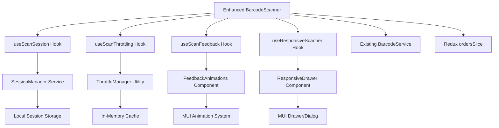

# Design Document

## Overview

This design document outlines the technical implementation for enhancing the existing BarcodeScanner component with throttling, visual feedback, session management, scan history, and mobile-first bottom sheet UI. The enhancements will transform the scanner from a simple modal dialog into a professional, session-based scanning interface optimized for mobile workflows.

The design builds upon the existing BarcodeScanner component (506 lines) by adding modular session management, custom hooks for state management, and responsive UI components that adapt to mobile and desktop contexts.

## Steering Document Alignment

### Technical Standards (tech.md)
- **React 18 + TypeScript**: Leverages existing React patterns with strict TypeScript for enhanced scanner functionality
- **Material-UI Components**: Extends current MUI usage with Drawer/BottomSheet for mobile-first design
- **Redux State Management**: Integrates with existing ordersSlice for scan session persistence
- **Modular Architecture**: Follows established service layer separation with new custom hooks and utilities
- **Client-Side Processing**: Maintains client-side scanning approach with enhanced session management

### Project Structure (structure.md)
- **Feature-Based Organization**: Enhancements contained within todaysOrders/components following existing patterns
- **Custom Hooks**: New hooks in shared/hooks/ directory for cross-component reusability
- **Service Extension**: Extends existing BarcodeService without breaking changes
- **Type Safety**: New TypeScript interfaces in types/barcode.ts following established conventions
- **Testing Colocation**: Component tests remain colocated in __tests__ directories

## Code Reuse Analysis

### Existing Components to Leverage
- **BarcodeScanner.tsx**: Base component with camera initialization and manual entry patterns - will be enhanced not replaced
- **Material-UI Dialog/Drawer**: Current Dialog pattern will be augmented with responsive Drawer for mobile bottom sheet
- **Quagga Integration**: Existing camera management patterns will be extended with session persistence
- **Redux ordersSlice**: Current completion tracking will be enhanced with session state management

### Integration Points
- **BarcodeService**: Existing service will be extended with throttling utilities and session management
- **ordersSlice**: Current completion actions will integrate with new session statistics tracking
- **Types/barcode.ts**: New session-related interfaces will extend existing barcode type definitions
- **Mobile Responsive Patterns**: Existing useMediaQuery patterns will be extended for bottom sheet behavior

## Architecture

The enhanced scanner follows a layered architecture with clear separation of concerns:

### Modular Design Principles
- **Single File Responsibility**: Each enhancement (throttling, feedback, session) isolated in separate custom hooks
- **Component Isolation**: Bottom sheet UI separated from core scanning logic for maintainability  
- **Service Layer Separation**: Session management utilities kept in services layer, UI logic in presentation layer
- **Utility Modularity**: Throttling, animation, and session utilities as focused, reusable modules



## Components and Interfaces

### Enhanced BarcodeScanner Component
- **Purpose:** Main scanner interface with session management and responsive UI
- **Interfaces:** Extends existing BarcodeScannerProps with session configuration options
- **Dependencies:** useScanSession, useScanThrottling, useScanFeedback, useResponsiveScanner hooks
- **Reuses:** Existing camera initialization, manual entry, and service integration patterns

### useScanSession Hook  
- **Purpose:** Manages scan session state, history, and statistics
- **Interfaces:** Returns session state, history array, statistics object, and session control methods
- **Dependencies:** SessionManager service, Redux ordersSlice for persistence integration
- **Reuses:** Existing state management patterns from ordersSlice

### useScanThrottling Hook
- **Purpose:** Prevents duplicate scans with configurable throttle periods
- **Interfaces:** Returns throttled scan handler and throttle status checker
- **Dependencies:** ThrottleManager utility with Map-based cache
- **Reuses:** Existing error handling patterns from BarcodeService

### useScanFeedback Hook
- **Purpose:** Manages visual feedback animations and user notifications
- **Interfaces:** Returns feedback trigger methods and animation state
- **Dependencies:** FeedbackAnimations component, MUI Snackbar system
- **Reuses:** Existing Alert and notification patterns from codebase

### useResponsiveScanner Hook
- **Purpose:** Handles responsive UI behavior and mobile bottom sheet functionality
- **Interfaces:** Returns responsive configuration and UI component selections
- **Dependencies:** MUI useMediaQuery, ResponsiveDrawer component
- **Reuses:** Existing responsive patterns from CategoryGroupedTable

### ResponsiveDrawer Component
- **Purpose:** Adaptive container that renders as Drawer on mobile, Dialog on desktop
- **Interfaces:** Extends MUI Drawer/Dialog props with responsive behavior
- **Dependencies:** MUI Drawer, Dialog, useMediaQuery
- **Reuses:** Existing modal patterns and responsive breakpoints

### SessionManager Service
- **Purpose:** Business logic for scan session management and history tracking
- **Interfaces:** Session CRUD operations, history management, statistics calculation
- **Dependencies:** Local storage utilities, timestamp management
- **Reuses:** Existing service patterns from BarcodeService base class

### ThrottleManager Utility
- **Purpose:** Throttle and debounce logic for scan prevention
- **Interfaces:** Throttle check, cache management, cleanup utilities
- **Dependencies:** Native Map for cache, setTimeout for time management
- **Reuses:** Existing utility patterns from dateUtils and validationUtils

## Data Models

### ScanSession Interface
```typescript
interface ScanSession {
  sessionId: string;              // Unique session identifier
  startTime: string;              // ISO timestamp when session started
  isActive: boolean;              // Whether session is currently active
  statistics: SessionStatistics;   // Real-time session stats
  history: ScanHistoryEntry[];    // Chronological scan history
}
```

### SessionStatistics Interface
```typescript
interface SessionStatistics {
  totalScans: number;          // Total scan attempts
  successfulScans: number;     // Successful completions
  errorScans: number;          // Failed scan attempts  
  duplicateScans: number;      // Throttled duplicate attempts
  sessionDuration: number;     // Duration in milliseconds
  lastActivityTime: string;    // ISO timestamp of last scan
}
```

### ScanHistoryEntry Interface
```typescript
interface ScanHistoryEntry {
  entryId: string;           // Unique entry identifier
  barcodeId?: string;        // Scanned barcode ID (if successful)
  timestamp: string;         // ISO timestamp of scan attempt
  status: 'success' | 'error' | 'duplicate'; // Scan result status
  orderData?: {              // Order information (if found)
    productName: string;
    sku?: string;
    platform: string;
  };
  errorMessage?: string;     // Error details (if failed)
  processingTime: number;    // Time taken for scan processing (ms)
}
```

### ResponsiveConfig Interface
```typescript
interface ResponsiveConfig {
  isMobile: boolean;         // Mobile device detection
  isTablet: boolean;         // Tablet device detection
  containerType: 'drawer' | 'dialog'; // UI container selection
  fullScreen: boolean;       // Full screen mode flag
  slideDirection: 'up' | 'left' | 'right'; // Animation direction
}
```

### ThrottleEntry Interface
```typescript
interface ThrottleEntry {
  barcodeId: string;         // Throttled barcode identifier
  firstScanTime: number;     // Timestamp of initial scan
  lastAttemptTime: number;   // Timestamp of most recent attempt
  attemptCount: number;      // Number of throttled attempts
}
```

## Error Handling

### Error Scenarios

1. **Camera Initialization Failures**
   - **Handling:** Graceful fallback to manual entry mode with user notification
   - **User Impact:** Clear error message with manual entry option, session continues uninterrupted

2. **Session State Corruption**
   - **Handling:** Session reset with user confirmation, preserve successful scans if possible
   - **User Impact:** Warning dialog with option to continue or restart session

3. **Throttle Cache Memory Issues**
   - **Handling:** Automatic cache cleanup with size limits, fallback to temporary throttling
   - **User Impact:** Transparent handling, throttling may be temporarily less effective

4. **Mobile Bottom Sheet Gesture Conflicts**
   - **Handling:** Disable conflicting gestures when scanner is active, provide clear close affordances
   - **User Impact:** Prevented accidental closures, explicit close button always visible

5. **Animation Performance Issues**
   - **Handling:** Reduce motion for low-performance devices, fallback to simple state indicators
   - **User Impact:** Faster response with simplified visual feedback on slower devices

6. **Session History Overflow**
   - **Handling:** Implement circular buffer with maximum 100 entries, oldest entries pruned
   - **User Impact:** Consistent performance with recent history always available

## Testing Strategy

### Unit Testing
- **Custom Hooks Testing**: React Testing Library renderHook for session, throttling, and feedback hooks
- **Utility Functions**: Jest unit tests for ThrottleManager, SessionManager business logic
- **Component Integration**: Test enhanced BarcodeScanner with mocked dependencies
- **Responsive Behavior**: Test ResponsiveDrawer component across different viewport sizes

### Integration Testing  
- **End-to-End Scanning Flow**: Test complete scan workflow with session management
- **Mobile Bottom Sheet Behavior**: Test gesture handling and responsive transitions
- **Throttling Integration**: Test throttle behavior integrated with actual scanning operations
- **Redux State Integration**: Test session statistics integration with ordersSlice

### End-to-End Testing
- **Multi-Device Scanning Session**: Test full scanning workflow on mobile and desktop
- **Long-Running Session Scenarios**: Test session persistence and memory management over extended use
- **Error Recovery Workflows**: Test graceful degradation and recovery from various error states
- **Performance Under Load**: Test scanner performance with rapid scanning and large session histories

### Mobile-Specific Testing
- **Touch Gesture Testing**: Validate bottom sheet gesture handling and prevention of accidental closure
- **Orientation Change Testing**: Test scanner behavior during device rotation
- **Camera Permission Testing**: Test camera access flows and fallback scenarios on mobile devices
- **Battery/Performance Impact**: Test resource usage during extended mobile scanning sessions