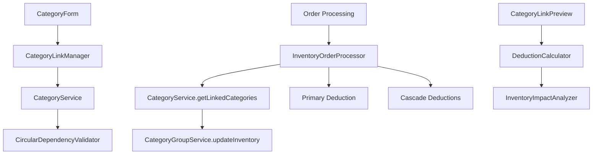

# Design Document

## Overview

The Category Linking Cascade Deduction feature extends the existing inventory management system by enabling categories to specify other categories that should have inventory deducted when orders are processed. This creates a cascade deduction system where processing an order for a primary category (e.g., "Laptop Assembly") automatically triggers inventory deductions from linked categories (e.g., "Processors", "RAM", "Packaging") using their existing `inventoryDeductionQuantity` configurations.

The design leverages the current category-based inventory system and InventoryOrderProcessor workflow, adding a simple linking mechanism that maintains consistency with existing deduction patterns while enabling complex inventory relationships.

## Steering Document Alignment

### Technical Standards (tech.md)

**TypeScript and React Patterns**: The design follows strict TypeScript typing with React functional components and Material-UI design system. All new components will use the established patterns of Redux Toolkit for state management and React Hook Form for form handling.

**Firebase Integration**: Extends the existing FirebaseService pattern with CategoryService enhancements, maintaining the established service inheritance model and Firebase transactions for data consistency.

**Client-Side Processing**: Maintains the client-side approach with validation and business logic handled in services, following the established security model of keeping sensitive operations on the client side.

**Performance Requirements**: Designed to meet the <2 second response time requirement for dashboard queries, with circular dependency validation completing within 500ms for complex category hierarchies.

### Project Structure (structure.md)

**Feature-Based Organization**: New components will be added to `src/pages/categories/components/` following the established feature-first structure. Category linking UI components will be colocated with existing category management components.

**Service Layer Extension**: CategoryService will be enhanced with linking methods following the established service class organization pattern (public API methods, private helpers, error handling utilities).

**Type Definitions**: New interfaces will be added to `src/types/category.ts` following the established naming conventions and TypeScript patterns.

**Testing Structure**: Tests will be colocated following the `__tests__/` directory pattern with comprehensive unit and integration test coverage.

## Code Reuse Analysis

### Existing Components to Leverage

- **CategoryService**: Will be extended with new linking methods while maintaining existing API compatibility
- **InventoryOrderProcessor**: Current cascade deduction logic will be enhanced to process category links
- **CategoryGroupService**: `updateInventory()` method will be reused for processing cascade deductions
- **Material-UI DataTable patterns**: Existing category management tables will be extended for link management
- **ValidationResult interfaces**: Current validation patterns will be reused for link validation
- **CategoryForm components**: Existing form patterns will be extended for link configuration

### Integration Points

- **Existing Category Management**: Link management will be integrated into current category CRUD workflows
- **Current Deduction System**: Cascade deductions will use existing `inventoryDeductionQuantity` and CategoryGroup inventory tracking
- **Order Processing Pipeline**: InventoryOrderProcessor will be enhanced to process both primary and cascade deductions
- **Firebase Data Model**: Category documents will be extended with `linkedCategories` array field for backward compatibility

## Architecture

The design follows a **Service-Oriented Architecture** with clear separation between data access, business logic, and presentation layers. The linking system is implemented as an extension to the existing category management system rather than a separate module, ensuring consistency and reusability.

### Modular Design Principles

- **Single File Responsibility**: CategoryLinkingService handles all linking operations, CircularDependencyValidator handles dependency validation
- **Component Isolation**: CategoryLinkManager component focuses solely on link CRUD operations, separate from category form logic
- **Service Layer Separation**: Business logic for link validation and cascade processing isolated in services
- **Utility Modularity**: Circular dependency validation extracted to focused, reusable utility module



## Components and Interfaces

### CategoryLinkManager Component
- **Purpose:** Manage category-to-category linking relationships through an intuitive interface
- **Interfaces:** Props for category ID, onLinksChanged callback, validation error display
- **Dependencies:** CategoryService for CRUD operations, Material-UI for consistent styling
- **Reuses:** Existing DataTable patterns, validation error display components, confirmation dialogs

### CircularDependencyValidator Utility
- **Purpose:** Validate category linking operations to prevent circular dependencies
- **Interfaces:** `validateLink(sourceId, targetId)`, `checkCircularDependency(categoryId, visited)`
- **Dependencies:** CategoryService for category data access
- **Reuses:** Existing validation pattern interfaces, error handling utilities

### DeductionPreviewModal Component
- **Purpose:** Display cascade deduction impact before order processing
- **Interfaces:** Props for order items, preview data, onConfirm/onCancel callbacks
- **Dependencies:** InventoryOrderProcessor for deduction calculations
- **Reuses:** Existing modal patterns, inventory display components, warning indicators

### Enhanced InventoryOrderProcessor
- **Purpose:** Process both primary and cascade deductions during order processing
- **Interfaces:** Existing `processOrderWithCategoryDeduction()` enhanced with cascade logic
- **Dependencies:** CategoryService for link data, CategoryGroupService for inventory updates
- **Reuses:** Current deduction processing pipeline, error handling, audit trail logging

## Data Models

### CategoryLink Interface
```typescript
interface CategoryLink {
  categoryId: string;           // Target category to deduct from
  isActive?: boolean;          // Allow temporary disable without deletion
  createdAt?: Timestamp;       // When link was created
}
```

### Enhanced Category Interface
```typescript
interface Category {
  // ... existing fields
  linkedCategories?: CategoryLink[];  // Array of linked categories
}
```

### DeductionPreview Interface
```typescript
interface DeductionPreview {
  primaryDeductions: DeductionItem[];
  cascadeDeductions: CascadeDeductionItem[];
  warnings: string[];
  inventoryImpacts: InventoryImpact[];
}

interface CascadeDeductionItem {
  sourceCategory: string;
  targetCategory: string;
  targetGroup: string;
  quantity: number;
  unit: string;
  resultingInventory: number;
}
```

## Error Handling

### Error Scenarios

1. **Circular Dependency Detection**
   - **Handling:** Pre-validation before link creation, comprehensive dependency traversal
   - **User Impact:** Clear error message with dependency chain visualization, link creation blocked

2. **Invalid Target Category**
   - **Handling:** Validation ensures target category exists and has group assignment
   - **User Impact:** Helpful error message suggesting category group assignment steps

3. **Cascade Deduction Failures**
   - **Handling:** Atomic transaction rollback, detailed error logging, partial failure recovery
   - **User Impact:** Clear indication of which deductions failed, option to retry or proceed with warnings

4. **Missing Inventory Configuration**
   - **Handling:** Validation checks for `inventoryDeductionQuantity` and category group assignment
   - **User Impact:** Guided setup flow to configure required inventory settings

## Testing Strategy

### Unit Testing

**CategoryService Link Methods**: Test CRUD operations for category links, validation logic, error handling
- `addCategoryLink()` with valid and invalid inputs
- `removeCategoryLink()` with existing and non-existing links
- `getLinkedCategories()` data retrieval and formatting

**CircularDependencyValidator**: Test dependency detection algorithms
- Direct circular dependencies (A→B→A)
- Indirect circular dependencies (A→B→C→A)
- Complex chain validation with multiple levels
- Performance testing with large category hierarchies

**Cascade Deduction Logic**: Test InventoryOrderProcessor enhancements
- Single category with multiple links
- Multiple categories each with links
- Mixed units and decimal quantities
- Error scenarios and rollback behavior

### Integration Testing

**End-to-End Link Management**: Test complete workflow from link creation to order processing
- Create category links through UI
- Process orders and verify cascade deductions
- Handle validation errors and user corrections
- Verify inventory accuracy across all affected groups

**Database Transaction Integrity**: Test Firebase transaction behavior
- Concurrent link modifications
- Partial failure recovery
- Data consistency after errors
- Audit trail completeness

### End-to-End Testing

**Real-World Business Scenarios**: Test complex business workflows
- Manufacturing assembly process (components + packaging + materials)
- Retail kit sales (multiple product categories)
- Service delivery (hardware + consumables + labor tracking)

**Performance and Scalability**: Test system behavior with realistic data volumes
- 100+ categories with complex linking relationships
- Large order batches with extensive cascade effects
- UI responsiveness during complex operations
- Memory usage during deep dependency validation