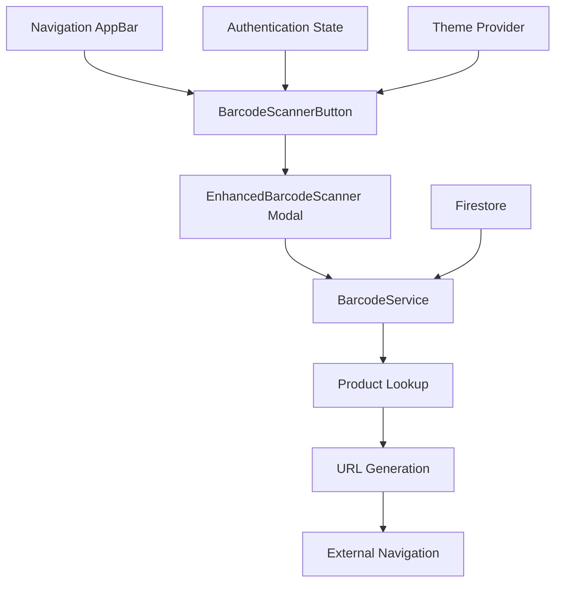

# Design Document: Navigation Barcode Scanner

## Overview

The Navigation Barcode Scanner feature adds a globally accessible barcode scanner button to the application's navigation bar. When activated, it opens the existing EnhancedBarcodeScanner component configured for product identification. Upon successful product identification, it automatically opens the corresponding Amazon or Flipkart marketplace listing in a new browser tab, providing immediate access to live product pages.

The design leverages existing barcode infrastructure while introducing minimal new components, ensuring consistency with current patterns and maintaining the application's modular architecture.

## Steering Document Alignment

### Technical Standards (tech.md)
- **React 18 + TypeScript**: Uses functional components with strict TypeScript typing
- **Material-UI Integration**: Follows existing AppBar design patterns with consistent iconography
- **Service Layer Separation**: Leverages existing BarcodeService without modification
- **Firebase Integration**: Reuses existing product lookup infrastructure
- **Component Architecture**: Maintains single responsibility principle with focused, reusable components

### Project Structure (structure.md)
- **Feature-First Organization**: Scanner button integrated into existing navigation structure
- **Component Colocation**: Scanner-specific logic contained within navigation components
- **Service Reuse**: Utilizes existing services without creating duplicate functionality
- **Type Safety**: Comprehensive TypeScript coverage for all new interfaces and components

## Code Reuse Analysis

### Existing Components to Leverage
- **EnhancedBarcodeScanner**: Complete reuse for scanner modal functionality with custom configuration for product lookup
- **BarcodeService**: Full reuse for product identification and barcode validation
- **AppBar Component**: Extended to include scanner button without modifying core structure
- **ViewAmazonListingButton/ViewFlipkartListingButton**: URL generation logic reused for navigation

### Integration Points
- **Navigation System**: Seamless integration with existing AppBar and routing infrastructure
- **Authentication**: Leverages existing auth state to control scanner button visibility
- **Product Database**: Connects to existing Firestore product collections and schemas
- **Theme System**: Adapts to existing light/dark theme switching mechanisms

## Architecture

The design follows a layered architecture pattern that maintains clear separation of concerns while maximizing reuse of existing infrastructure:



### Modular Design Principles
- **Single File Responsibility**: BarcodeScannerButton handles only scanner activation and configuration
- **Component Isolation**: Scanner button is self-contained with clear props interface
- **Service Layer Separation**: Product lookup logic remains in BarcodeService, navigation logic in presentation layer
- **Utility Modularity**: URL generation utilities extracted for reusability

## Components and Interfaces

### BarcodeScannerButton
- **Purpose:** Renders scanner icon button in navigation bar and manages scanner modal state
- **Interfaces:** 
  ```typescript
  interface BarcodeScannerButtonProps {
    className?: string;
    disabled?: boolean;
    onScanSuccess?: (result: ScanningResult) => void;
    onScanError?: (error: string) => void;
  }
  ```
- **Dependencies:** @mui/material/IconButton, @mui/icons-material/QrCodeScanner, EnhancedBarcodeScanner
- **Reuses:** EnhancedBarcodeScanner component with custom onScanSuccess callback

### ProductNavigationService
- **Purpose:** Handles product identification and marketplace URL navigation logic
- **Interfaces:**
  ```typescript
  interface ProductNavigationService {
    navigateToProduct(scanResult: ScanningResult): Promise<void>;
    generateProductUrl(product: Product): string | null;
    openExternalUrl(url: string): void;
  }
  ```
- **Dependencies:** BarcodeService for product lookup, existing URL generation utilities
- **Reuses:** ViewAmazonListingButton and ViewFlipkartListingButton URL generation patterns

### Enhanced AppBar Integration
- **Purpose:** Integrates scanner button into existing navigation layout
- **Interfaces:** Extends existing AppBar props without breaking changes
- **Dependencies:** Existing AppBar component, authentication state
- **Reuses:** Current AppBar styling, theme integration, and responsive behavior

## Data Models

### ScanningResult Extension
```typescript
interface ProductScanningResult extends ScanningResult {
  success: true;
  product?: {
    sku: string;
    name: string;
    platform: 'amazon' | 'flipkart';
    metadata?: {
      amazonSerialNumber?: string;
      flipkartSerialNumber?: string;
    };
  };
}
```

### Scanner Configuration
```typescript
interface NavigationScannerConfig {
  enableProductLookup: true;
  autoNavigate: true;
  closeOnSuccess: true;
  priorityPlatform: 'amazon' | 'flipkart';
}
```

## Error Handling

### Error Scenarios
1. **Product Not Found**
   - **Handling:** Display "Product not found" message in scanner feedback
   - **User Impact:** Clear indication that barcode doesn't match any products in system

2. **No Marketplace Serial Numbers**
   - **Handling:** Show "Product found but no marketplace listing available" message
   - **User Impact:** User understands product exists but cannot navigate to external listing

3. **Network/Database Errors**
   - **Handling:** Display "Network error, please try again" with retry option
   - **User Impact:** Temporary error with clear recovery path

4. **Invalid Barcode Format**
   - **Handling:** Immediate format validation with helpful error message
   - **User Impact:** Clear guidance on expected barcode format

5. **Camera Access Denied**
   - **Handling:** Automatic fallback to manual barcode entry mode
   - **User Impact:** Seamless degradation without feature loss

6. **Popup Blocker Interference**
   - **Handling:** Detect blocked popups and provide manual link option
   - **User Impact:** Alternative method to access product listing

## Testing Strategy

### Unit Testing
- **BarcodeScannerButton Component**: 
  - Button rendering and theme adaptation
  - Modal open/close state management
  - Props interface validation
  - Authentication-based visibility
- **ProductNavigationService**:
  - URL generation logic for Amazon/Flipkart
  - Platform priority handling
  - Error scenario responses
  - External navigation invocation

### Integration Testing
- **Scanner to Product Lookup Flow**:
  - End-to-end barcode scanning to product identification
  - BarcodeService integration with navigation logic
  - Firebase product collection queries
- **Navigation Integration**:
  - AppBar scanner button integration
  - Theme switching behavior
  - Responsive layout adaptation
- **URL Generation Integration**:
  - Reuse of existing ActionButtons URL logic
  - Platform-specific navigation paths

### End-to-End Testing
- **Complete User Workflows**:
  - Scan valid product barcode → opens correct marketplace listing
  - Scan invalid barcode → displays appropriate error message
  - Scanner access from different pages → consistent behavior
  - Authentication state changes → button visibility updates
- **Cross-Browser Compatibility**:
  - Camera access permissions across browsers
  - Popup/new tab behavior consistency
  - Mobile responsive scanner interface
- **Error Recovery Flows**:
  - Network interruption during scanning
  - Camera permission denied scenarios
  - Invalid barcode format handling

### Performance Testing
- **Scanner Activation Speed**: Button click to modal open < 200ms
- **Product Lookup Performance**: Barcode to product resolution < 2 seconds
- **Memory Impact**: Scanner integration < 5MB baseline increase
- **Bundle Size Impact**: New components < 50KB compressed

### Accessibility Testing
- **Keyboard Navigation**: Scanner button accessible via keyboard
- **Screen Reader Compatibility**: Proper ARIA labels and descriptions
- **High Contrast Mode**: Scanner button visible in accessibility themes
- **Focus Management**: Modal focus handling for keyboard users

## Security Considerations

### Input Validation
- All barcode inputs validated before database queries
- Sanitization of barcode strings to prevent injection attacks
- Rate limiting on barcode lookup requests

### External Navigation Safety
- URL validation before opening external marketplace links
- Secure target="_blank" with rel="noopener noreferrer"
- No sensitive data passed in URL parameters

### Authentication Integration
- Scanner functionality gated behind existing authentication
- Consistent with current authorization patterns
- No additional permission requirements

## Deployment Strategy

### Rollout Plan
1. **Development Phase**: Feature flag controlled rollout
2. **Internal Testing**: Enable for admin users only
3. **Beta Release**: Gradual rollout to subset of authenticated users
4. **Full Release**: Complete feature activation

### Monitoring and Analytics
- Scanner usage metrics and success rates
- Error tracking for failed product lookups
- Performance monitoring for scan-to-navigation timing
- User engagement analytics for feature adoption

### Rollback Strategy
- Feature flag based immediate disable capability
- Graceful degradation without navigation bar disruption
- Minimal component coupling enables clean removal