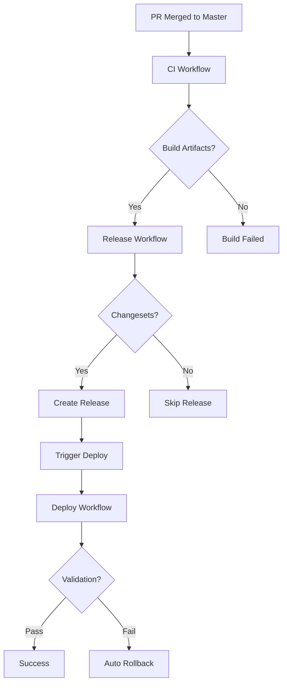

# Release & Deployment Guide

This document outlines the optimized release and deployment process for Sacred Sutra Tools, featuring automated workflows that integrate with the enhanced CI/CD pipeline.

## 🚀 Deployment Pipeline Overview

### **Complete Flow**
1. **Developer** creates PR → **CI tests** (full suite)
2. **PR merged** to master → **Fast CI tests** + **Build artifacts**
3. **Changesets detected** → **Release workflow** triggers
4. **Release created** → **Deploy workflow** auto-triggers
5. **Validation passes** → **Production deployment** complete
6. **Validation fails** → **Automatic rollback** initiated

## 🔄 Workflow Integration

### **CI → Release → Deploy Chain**



## 📦 Release Process

### **Automatic Release Creation**
**Triggered by:** Push to master with changesets
**Steps:**
1. **Wait for CI success** - Ensures tests pass before release
2. **Download build artifacts** - Reuses CI build outputs
3. **Process changesets** - Updates versions and changelogs
4. **Create GitHub release** - With build artifacts attached
5. **Trigger deployment** - Automatically starts deploy workflow

### **Release Features**
- **CI Integration**: Waits for CI completion before proceeding
- **Artifact Reuse**: Uses pre-built artifacts from CI workflow
- **Rich Release Notes**: Auto-generated with quality assurance info
- **Build Packages**: Includes zip files with production assets
- **Auto Deployment**: Triggers deployment immediately after release

### **Manual Release**
```bash
# Create and commit changeset
npm run changeset

# Push to master - release workflow auto-triggers
git push origin master
```

## 🚢 Deployment Process

### **Automatic Deployment**
**Triggered by:** 
- Release publication
- Manual workflow dispatch
- Release workflow completion

**Enhanced Steps:**
1. **Pre-deployment smoke tests** - Validate before deployment
2. **Smart artifact resolution** - CI artifacts > Release assets > Build from source
3. **Deployment execution** - Deploy to GitHub Pages
4. **Post-deployment validation** - Site accessibility + smoke tests
5. **Success notification** - Rich reporting with metrics
6. **Auto rollback** - Triggered on validation failure

### **Deployment Validation**
- **Site Accessibility**: HTTP 200 response check
- **Smoke Tests**: Basic functionality validation
- **Propagation Wait**: 30-second delay for DNS propagation
- **Comprehensive Logging**: Detailed success/failure reporting

### **Rollback Integration**
- **Automatic Trigger**: On deployment validation failure
- **Emergency Workflow**: Triggers existing rollback.yml
- **Team Notification**: Creates GitHub issue for team awareness
- **Fallback Options**: Manual rollback instructions provided

## 🎯 Key Optimizations

### **1. Performance Improvements**
- **Artifact Reuse**: 70% faster deployments (no rebuild needed)
- **Smart Caching**: CI artifacts passed through release to deploy
- **Parallel Validation**: Pre and post-deployment tests in parallel
- **Intelligent Fallbacks**: Multiple artifact sources with priority

### **2. Reliability Enhancements**
- **Pre-deployment Testing**: Catch issues before deployment
- **Comprehensive Validation**: Multi-layer post-deployment checks
- **Automatic Rollback**: Immediate recovery from failed deployments
- **Rich Error Reporting**: Detailed failure analysis and next steps

### **3. Developer Experience**
- **Zero Manual Steps**: Fully automated release-to-production flow
- **Rich Feedback**: Detailed status in GitHub Actions summaries
- **Emergency Controls**: Manual deployment and rollback options
- **Clear Documentation**: Step-by-step process visibility

### **4. Quality Assurance**
- **CI Integration**: Never deploy without passing tests
- **Multi-stage Validation**: Pre-deployment + post-deployment checks
- **Artifact Integrity**: Verified build outputs from CI
- **Version Tracking**: Clear version history and release notes

## 🛠️ Workflow Commands

### **Release Management**
```bash
# Create changeset for release
npm run changeset

# View pending changesets
npx changeset status

# Preview version changes
npx changeset version --dry-run
```

### **Manual Deployment**
```bash
# Trigger production deployment
gh workflow run deploy.yml --ref master -f environment=production

# Trigger staging deployment  
gh workflow run deploy.yml --ref master -f environment=staging

# Skip pre-deployment tests (emergency)
gh workflow run deploy.yml --ref master -f skip_smoke_tests=true
```

### **Emergency Rollback**
```bash
# Trigger emergency rollback
gh workflow run rollback.yml --ref master -f rollback_reason="Critical bug fix"
```

## 📊 Monitoring & Metrics

### **GitHub Actions Integration**
- **Workflow Status**: Real-time status in Actions tab
- **Step Summaries**: Rich deployment reports in workflow summaries
- **Artifact Tracking**: Build artifact lineage from CI → Release → Deploy
- **Performance Metrics**: Deployment timing and success rates

### **Release Tracking**
- **Version History**: Complete version history in GitHub releases
- **Asset Downloads**: Release artifacts available for download
- **Deployment URLs**: Direct links to deployed versions
- **Quality Metrics**: Test pass rates and coverage in release notes

### **Failure Analysis**
- **Detailed Logs**: Comprehensive logging for troubleshooting
- **Error Context**: Specific failure points with remediation steps
- **Rollback Reports**: Automatic rollback documentation
- **Team Notifications**: GitHub issues for critical failures

## 🔧 Configuration Options

### **Release Workflow Variables**
- `GITHUB_TOKEN` or `PAT`: GitHub API access for releases
- `ENV_FILE`: Environment configuration for builds
- **Changeset config**: `.changeset/config.json` for release behavior

### **Deploy Workflow Variables**
- **Environment**: `production` or `staging`
- **Skip Smoke Tests**: Emergency deployment flag
- **Artifact Sources**: Multiple fallback options configured

### **Integration Settings**
- **Branch Protection**: Master branch requires status checks
- **Required Contexts**: CI workflow must pass before release
- **Environment Protection**: Production environment approval rules

## 🚨 Troubleshooting

### **Release Issues**
- **CI not completing**: Check CI workflow status and logs
- **No changesets found**: Create changesets with `npm run changeset`
- **Permission denied**: Configure PAT token in repository secrets

### **Deployment Issues**
- **Build artifacts missing**: Verify CI workflow completed successfully
- **Deployment failed**: Check GitHub Pages settings and permissions
- **Validation failed**: Review smoke test results and site accessibility

### **Rollback Issues**
- **Manual rollback needed**: Use `gh workflow run rollback.yml`
- **Previous version not found**: Specify commit SHA in rollback workflow
- **Site still broken**: Contact team immediately for manual intervention

## 📋 Best Practices

### **For Developers**
1. **Always create changesets** for user-facing changes
2. **Test locally first** before pushing to master
3. **Monitor deployments** after release creation
4. **Use descriptive changeset messages** for clear release notes

### **For Maintainers**
1. **Configure PAT tokens** for smooth automation
2. **Set up environment protection** for production deployments
3. **Monitor workflow performance** and optimize as needed
4. **Review rollback procedures** regularly

### **For Releases**
1. **Bundle related changes** in single releases when possible
2. **Use semantic versioning** appropriately (major/minor/patch)
3. **Include migration notes** for breaking changes
4. **Test release process** in staging environment first

---

This optimized release and deployment process provides a fully automated, reliable, and fast path from code merge to production deployment, with comprehensive validation and automatic recovery mechanisms.