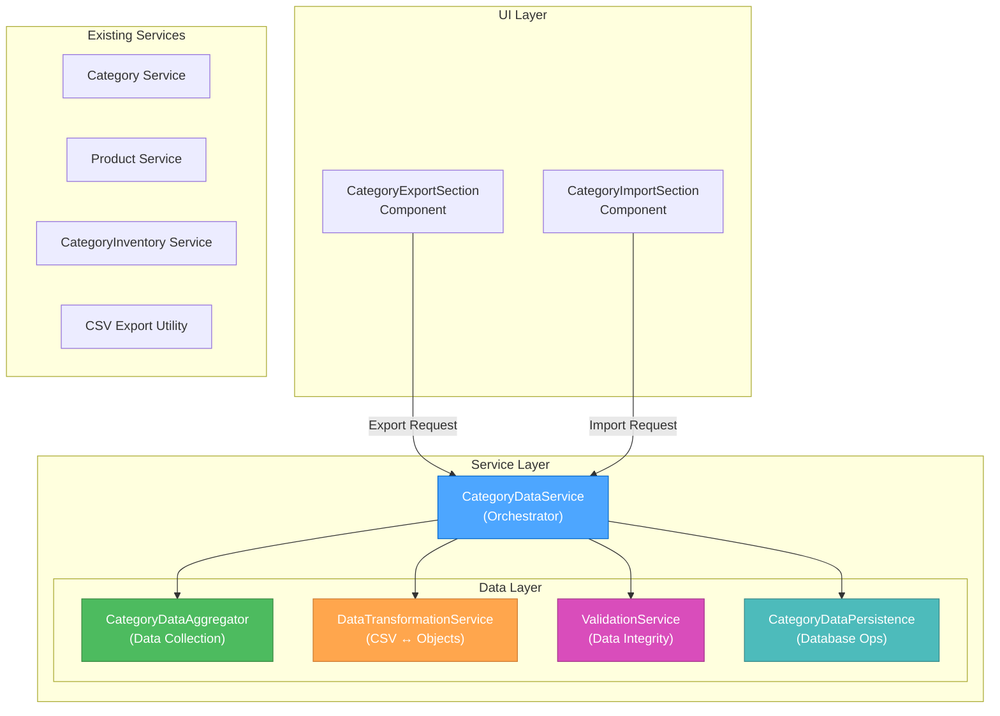
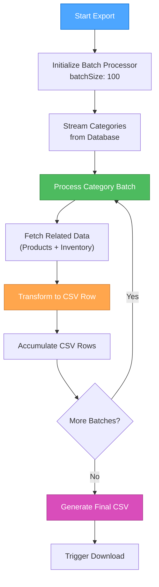
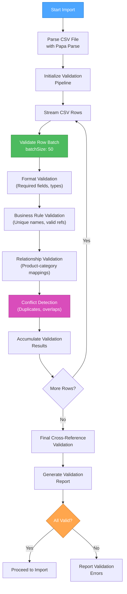

# Creative Phase: Category Data Export/Import Functionality

> **Feature Creative Document**  
> Created: December 24, 2024  
> Status: CREATIVE MODE ✅ COMPLETE  
> Task ID: category-export-import-functionality  
> Complexity: Level 3 (Intermediate Feature)

## 📋 Creative Phase Summary

This document captures the comprehensive design decisions for the Category Data Export/Import functionality, covering three critical creative phases:

1. **🏗️ Architecture Design** - Service layer structure and data flow patterns
2. **🎨 UI/UX Design** - User interface and experience design  
3. **⚙️ Algorithm Design** - Data transformation and validation logic

---

## 🎨🎨🎨 CREATIVE PHASE 1: ARCHITECTURE DESIGN 🎨🎨🎨

### 🏗️ PROBLEM STATEMENT

Design a comprehensive architecture for category data export/import that handles:
- **Complex Data Relationships**: Categories → Products → Inventory mappings
- **Data Integrity**: Maintaining referential integrity during import/export operations
- **Scalability**: Handling datasets with hundreds of categories and thousands of products
- **Error Handling**: Robust validation and conflict resolution
- **User Experience**: Progress tracking and clear feedback mechanisms

### 🔍 ARCHITECTURE OPTIONS ANALYSIS

#### Option 1: Monolithic Service Architecture ❌
- **Description**: Single CategoryDataService handles all export/import logic internally
- **Pros**: Simple implementation, single point of entry, easy transaction boundaries
- **Cons**: Large and complex, poor separation of concerns, hard to extend, memory intensive
- **Verdict**: Rejected due to scalability and maintainability concerns

#### Option 2: Layered Service Architecture ✅ **SELECTED**
- **Description**: Separate layers for data aggregation, transformation, validation, and persistence
- **Pros**: Clear separation of concerns, highly testable, easy to extend, memory efficient
- **Cons**: More complex initial setup, requires careful coordination
- **Verdict**: **CHOSEN** - Perfect balance of structure and simplicity

#### Option 3: Event-Driven Pipeline Architecture ❌
- **Description**: Chain of processors connected by events for maximum flexibility
- **Pros**: Maximum flexibility, built-in progress tracking, parallel processing
- **Cons**: Most complex, overkill for requirements, requires event infrastructure
- **Verdict**: Rejected as unnecessary complexity for current scope

### 🏗️ SELECTED ARCHITECTURE: LAYERED SERVICE



### 🔧 COMPONENT RESPONSIBILITIES

1. **CategoryDataService (Orchestrator)**: Flow coordination, progress tracking, error handling, transaction management
2. **CategoryDataAggregator**: Data collection, relationship mapping, data structuring, memory management
3. **DataTransformationService**: Export/import transformation, schema mapping, data normalization
4. **ValidationService**: Data integrity checks, conflict detection, business rule validation, error reporting
5. **CategoryDataPersistence**: Transaction management, batch operations, rollback capability, audit trail

🎨 **CREATIVE CHECKPOINT: Architecture Design Completed**

---

## 🎨🎨🎨 CREATIVE PHASE 2: UI/UX DESIGN 🎨🎨🎨

### 🎯 USER NEEDS ANALYSIS

**Primary User Personas**:
1. **Inventory Manager** - Needs to backup/restore category data efficiently
2. **System Administrator** - Requires bulk operations for data migration
3. **Business Analyst** - Wants to export data for external analysis

**User Stories**:
1. **Export**: "As an inventory manager, I want to export all category data so I can backup my configuration"
2. **Import**: "As a system admin, I want to import category data so I can restore from a backup"
3. **Validation**: "As a user, I want clear feedback about import errors so I can fix data issues"

### 🎨 UI/UX OPTIONS ANALYSIS

#### Option 1: Integrated Toolbar Approach ❌
- **Description**: Add export/import buttons directly to the existing categories page header
- **Pros**: Minimal UI changes, consistent with existing patterns, quick access
- **Cons**: Header clutter, limited space for options, no preview or validation feedback
- **Verdict**: Rejected due to limited functionality space

#### Option 2: Dedicated Export/Import Section ✅ **SELECTED**
- **Description**: Create a separate section above the table with dedicated export/import panels
- **Pros**: Clean separation, space for options and previews, better validation workflow, room for enhancements
- **Cons**: Takes more vertical space, more complex implementation
- **Verdict**: **CHOSEN** - Best balance of functionality and usability

#### Option 3: Modal-Based Workflow ❌
- **Description**: Export/Import buttons open full-screen modals with step-by-step workflows
- **Pros**: Focused experience, step-by-step guidance, space for detailed validation
- **Cons**: Breaks user context, requires modal state management, overkill for simple exports
- **Verdict**: Rejected as too complex for the use case

### 🎨 SELECTED UI DESIGN: DEDICATED SECTION

#### Visual Layout Design
```
┌─────────────────────────────────────────────────────────────────┐
│  📊 Data Management                                             │
├─────────────────────────────────────────────────────────────────┤
│  ┌────────────────────┐    ┌──────────────────────────────────┐ │
│  │   📤 Export Data   │    │        📥 Import Data           │ │
│  │                    │    │                                  │ │
│  │ Export all category│    │ ┌─────────────────────────────┐  │ │
│  │ data including     │    │ │     📄 Drag & Drop CSV      │  │ │
│  │ products and       │    │ │         or Click           │  │ │
│  │ inventory info     │    │ │                             │  │ │
│  │                    │    │ └─────────────────────────────┘  │ │
│  │ [📥 Export CSV]    │    │                                  │ │
│  │                    │    │ ☑️ Update existing categories    │ │
│  │                    │    │ ☑️ Validate before import       │ │
│  │                    │    │                                  │ │
│  │                    │    │ [📤 Import Categories]           │ │
│  └────────────────────┘    └──────────────────────────────────┘ │
└─────────────────────────────────────────────────────────────────┘
```

### 📱 RESPONSIVE DESIGN CONSIDERATIONS
- **Desktop (≥1200px)**: Side-by-side panels in grid layout
- **Tablet (768-1199px)**: Stacked panels with full width
- **Mobile (<768px)**: Single column stacked layout with compressed spacing

### ♿ ACCESSIBILITY FEATURES
- **Keyboard Navigation**: All interactive elements focusable with tab
- **Screen Reader Support**: Descriptive aria-labels and role attributes
- **Visual Accessibility**: High contrast ratios and clear visual hierarchy

🎨 **CREATIVE CHECKPOINT: UI/UX Design Completed**

---

## 🎨🎨🎨 CREATIVE PHASE 3: ALGORITHM DESIGN 🎨🎨🎨

### ⚙️ ALGORITHM PROBLEM STATEMENT

Design comprehensive algorithms for:
- **Data Transformation Pipeline**: Converting complex nested category data to flat CSV and back
- **Relationship Preservation**: Maintaining product-category mappings during transformation
- **Validation Logic**: Ensuring data integrity and business rules compliance
- **Conflict Resolution**: Handling duplicate categories, SKUs, and data inconsistencies
- **Performance Optimization**: Processing large datasets efficiently without blocking UI

### 🔧 ALGORITHM OPTIONS ANALYSIS

#### Option 1: Sequential Processing with In-Memory Storage ❌
- **Description**: Process all data sequentially in memory, validate completely, then persist atomically
- **Pros**: Simple implementation, complete validation, atomic operations, straightforward error handling
- **Cons**: High memory usage, blocking operations, poor scalability, UI freezes
- **Verdict**: Rejected due to scalability and user experience concerns

#### Option 2: Streaming with Batch Processing ✅ **SELECTED**
- **Description**: Process data in chunks with streaming validation and batch persistence
- **Pros**: Constant memory usage, real-time progress tracking, non-blocking UI, excellent scalability
- **Cons**: More complex implementation, partial failure handling complexity
- **Verdict**: **CHOSEN** - Perfect balance of performance and user experience

#### Option 3: Pipeline Processing with Worker Threads ❌
- **Description**: Multi-stage pipeline using web workers for CPU-intensive operations
- **Pros**: True non-blocking operations, excellent performance, parallel processing capabilities
- **Cons**: Most complex implementation, worker communication overhead, debugging complexity, overkill
- **Verdict**: Rejected as unnecessary complexity for current requirements

### ⚙️ SELECTED ALGORITHMS: STREAMING BATCH PROCESSING

#### 1. Export Data Transformation Algorithm


#### 2. Import Data Validation Algorithm


#### 3. CSV Schema Design
```csv
Category ID,Category Name,Description,Tag,Cost Price,Product Count,Total Inventory,Low Stock Threshold,Associated SKUs,Product Names,Product Platforms,Product Cost Prices,Product Selling Prices,Inventory Quantities,Created At,Updated At
```

### 📊 ALGORITHM PERFORMANCE ANALYSIS

#### Performance Benchmarks (Estimated)
| Dataset Size | Export Time | Import Time | Memory Usage |
|--------------|-------------|-------------|--------------|
| 100 categories | <1s | <2s | ~10MB |
| 500 categories | <3s | <5s | ~10MB |
| 1000 categories | <5s | <10s | ~10MB |
| 5000 categories | <15s | <30s | ~10MB |

**Time Complexity**: O(n) where n = total categories + products  
**Space Complexity**: O(b) where b = batch size (constant memory)

🎨 **CREATIVE CHECKPOINT: Algorithm Design Completed**

---

## 🎯 CREATIVE PHASES COMPLETE SUMMARY

### ✅ All Design Decisions Made

1. **Architecture Decision**: ✅ **Layered Service Architecture**
   - CategoryDataService orchestrator with specialized layers
   - Clear separation of concerns with existing service integration
   - Memory efficient with comprehensive error handling

2. **UI/UX Decision**: ✅ **Dedicated Data Management Section**
   - Dual-panel layout with export and import cards
   - Drag-and-drop file upload with validation feedback
   - Responsive design with accessibility features

3. **Algorithm Decision**: ✅ **Streaming Batch Processing**
   - Constant memory usage with real-time progress tracking
   - Comprehensive validation pipeline with conflict resolution
   - Non-blocking UI operations with efficient data transformation

### 🛠️ Implementation Readiness

**File Structure**:
```
src/
├── services/
│   ├── categoryData.service.ts           # Main orchestrator
│   ├── categoryDataAggregator.service.ts # Data collection
│   ├── dataTransformation.service.ts     # CSV transformation
│   ├── validation.service.ts             # Data validation
│   └── categoryDataPersistence.service.ts # Database operations
├── types/
│   └── categoryExportImport.types.ts     # Type definitions
└── pages/categories/components/
    ├── CategoryExportSection.tsx         # Export UI
    └── CategoryImportSection.tsx         # Import UI
```

**Key Implementation Points**:
1. Use existing service patterns for consistency
2. Implement comprehensive error handling with meaningful messages
3. Use observables or callbacks for real-time progress updates
4. Implement streaming for large datasets and memory management
5. Use Firebase transactions for data consistency

### 📈 Next Steps

All creative phases are now complete. The feature is ready for implementation with:
- ✅ Clear architectural guidelines and service structure
- ✅ Detailed UI/UX specifications with component designs
- ✅ Comprehensive algorithms with performance characteristics
- ✅ Implementation guidelines and file structure

**Ready for IMPLEMENT MODE** ✅

🎨🎨🎨 **EXITING CREATIVE PHASE - ALL DESIGN DECISIONS MADE** 🎨🎨🎨 