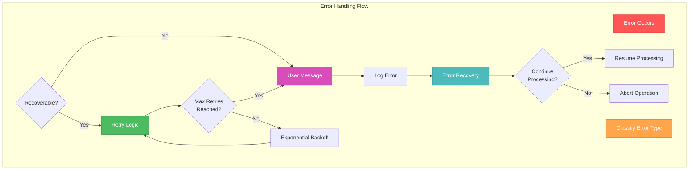
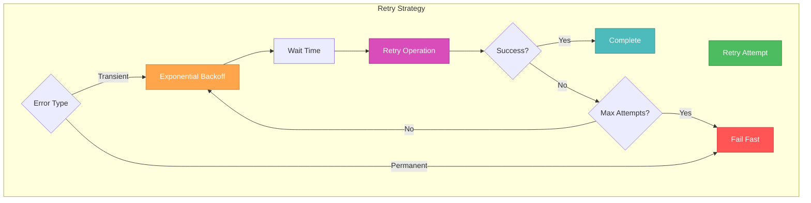

# 🎨🎨🎨 ENTERING CREATIVE PHASE: ERROR HANDLING STRATEGY 🎨🎨🎨

## Context
**System Requirements:**
- Handle individual file merge failures without breaking entire process
- Provide meaningful error messages to users
- Implement retry logic for transient failures
- Gracefully handle memory allocation errors
- Support cancellation of long-running operations
- Maintain data integrity during error recovery

**Technical Constraints:**
- Must integrate with existing Redux error handling patterns
- Must work with streaming chunked consolidation architecture
- Must provide user-friendly error messages
- Must maintain backward compatibility
- Must handle both synchronous and asynchronous errors

## Component Analysis

### Core Error Handling Components
- **Error Classification System**: Categorize different types of errors
- **Retry Mechanism**: Handle transient failures with exponential backoff
- **Error Recovery**: Graceful degradation and partial success handling
- **User Feedback System**: Clear error messages and progress updates
- **Cancellation Handler**: Clean resource cleanup on user cancellation

### Error Scenarios
- **File Validation Errors**: Invalid PDF structure, corrupted files
- **Memory Errors**: Out of memory during large file processing
- **Network Errors**: File loading failures, timeout issues
- **Processing Errors**: PDF merging failures, transformer errors
- **User Cancellation**: Manual cancellation of long-running operations

## Error Handling Options

### Option 1: Simple Try-Catch with Basic Error Messages
**Description**: Basic error handling with generic error messages and simple retry logic.

**Pros:**
- Simple implementation
- Minimal code complexity
- Quick to implement
- Easy to understand and maintain

**Cons:**
- Generic error messages not helpful to users
- No sophisticated retry logic
- Poor error recovery capabilities
- No progress feedback during errors
- Limited error categorization

**Technical Fit:** Low
**Complexity:** Low
**User Experience:** Poor

### Option 2: Comprehensive Error Handling with Classification
**Description**: Detailed error classification system with specific error types, retry logic, and user-friendly messages.

**Pros:**
- Specific error messages for different failure types
- Sophisticated retry logic with exponential backoff
- Graceful error recovery and partial success handling
- Detailed error logging for debugging
- Better user experience with clear feedback

**Cons:**
- More complex implementation
- Requires careful error categorization
- More code to maintain
- Potential for over-engineering

**Technical Fit:** High
**Complexity:** Medium
**User Experience:** Excellent

### Option 3: Error Handling with Recovery and Rollback
**Description**: Advanced error handling with automatic recovery, rollback capabilities, and intelligent retry strategies.

**Pros:**
- Automatic error recovery and rollback
- Intelligent retry strategies based on error type
- Comprehensive error tracking and analytics
- Advanced user feedback with recovery options
- Robust data integrity protection

**Cons:**
- Very complex implementation
- High maintenance overhead
- Potential performance impact
- Overkill for most error scenarios
- Difficult to test and debug

**Technical Fit:** Medium
**Complexity:** High
**User Experience:** Excellent

## Decision

**Chosen Option: Option 2 - Comprehensive Error Handling with Classification**

**Rationale:**
1. **User Experience**: Specific error messages help users understand and resolve issues
2. **Reliability**: Sophisticated retry logic handles transient failures effectively
3. **Maintainability**: Well-structured error handling is easier to maintain and debug
4. **Scalability**: Error classification system can be extended for future requirements
5. **Balance**: Optimal balance between complexity and functionality

**Implementation Considerations:**
- Implement error classification system with specific error types
- Add exponential backoff retry logic for transient failures
- Provide detailed error messages with actionable guidance
- Implement graceful degradation for partial failures
- Add comprehensive error logging for debugging

## Error Handling Architecture

### Error Classification System
```typescript
enum ErrorType {
  // File-related errors
  FILE_VALIDATION_ERROR = 'FILE_VALIDATION_ERROR',
  FILE_CORRUPTION_ERROR = 'FILE_CORRUPTION_ERROR',
  FILE_SIZE_ERROR = 'FILE_SIZE_ERROR',
  
  // Memory-related errors
  MEMORY_ALLOCATION_ERROR = 'MEMORY_ALLOCATION_ERROR',
  MEMORY_THRESHOLD_EXCEEDED = 'MEMORY_THRESHOLD_EXCEEDED',
  
  // Processing errors
  PDF_MERGE_ERROR = 'PDF_MERGE_ERROR',
  TRANSFORMER_ERROR = 'TRANSFORMER_ERROR',
  
  // Network/IO errors
  FILE_LOAD_ERROR = 'FILE_LOAD_ERROR',
  TIMEOUT_ERROR = 'TIMEOUT_ERROR',
  
  // User actions
  CANCELLATION_ERROR = 'CANCELLATION_ERROR',
  
  // System errors
  UNKNOWN_ERROR = 'UNKNOWN_ERROR'
}

interface ConsolidationError extends Error {
  type: ErrorType;
  fileIndex?: number;
  chunkIndex?: number;
  retryCount?: number;
  recoverable: boolean;
  userMessage: string;
  technicalDetails?: string;
}
```

### Error Handling Flow


### Retry Strategy


## Implementation Guidelines

### Error Handler Service
```typescript
class ConsolidationErrorHandler {
  private retryConfig: RetryConfig;
  private errorLog: ConsolidationError[] = [];
  
  constructor(config?: Partial<RetryConfig>) {
    this.retryConfig = {
      maxRetries: 3,
      baseDelay: 1000,
      maxDelay: 10000,
      backoffMultiplier: 2,
      ...config
    };
  }
  
  async handleError(
    error: ConsolidationError,
    operation: () => Promise<any>
  ): Promise<any> {
    // Log error
    this.logError(error);
    
    // Check if error is recoverable
    if (!error.recoverable) {
      throw error;
    }
    
    // Implement retry logic with exponential backoff
    return this.retryWithBackoff(operation, error);
  }
  
  private async retryWithBackoff(
    operation: () => Promise<any>,
    originalError: ConsolidationError
  ): Promise<any> {
    let lastError = originalError;
    
    for (let attempt = 1; attempt <= this.retryConfig.maxRetries; attempt++) {
      try {
        // Wait before retry (exponential backoff)
        if (attempt > 1) {
          const delay = Math.min(
            this.retryConfig.baseDelay * Math.pow(this.retryConfig.backoffMultiplier, attempt - 1),
            this.retryConfig.maxDelay
          );
          await this.sleep(delay);
        }
        
        return await operation();
      } catch (error) {
        lastError = this.classifyError(error, attempt);
        
        // If error is not recoverable, fail fast
        if (!lastError.recoverable) {
          throw lastError;
        }
      }
    }
    
    // Max retries reached
    throw lastError;
  }
  
  private classifyError(error: any, retryCount: number): ConsolidationError {
    // Error classification logic
    if (error.message.includes('memory')) {
      return {
        type: ErrorType.MEMORY_ALLOCATION_ERROR,
        message: error.message,
        recoverable: retryCount < 2, // Only retry once for memory errors
        userMessage: 'Insufficient memory to process files. Try with fewer files.',
        retryCount
      };
    }
    
    if (error.message.includes('PDF')) {
      return {
        type: ErrorType.PDF_MERGE_ERROR,
        message: error.message,
        recoverable: true,
        userMessage: 'Error merging PDF files. Retrying...',
        retryCount
      };
    }
    
    // Default classification
    return {
      type: ErrorType.UNKNOWN_ERROR,
      message: error.message,
      recoverable: false,
      userMessage: 'An unexpected error occurred. Please try again.',
      retryCount
    };
  }
  
  private logError(error: ConsolidationError): void {
    this.errorLog.push({
      ...error,
      timestamp: new Date().toISOString()
    });
    
    // Log to console for debugging
    console.error('Consolidation Error:', {
      type: error.type,
      message: error.message,
      userMessage: error.userMessage,
      retryCount: error.retryCount,
      timestamp: new Date().toISOString()
    });
  }
  
  private sleep(ms: number): Promise<void> {
    return new Promise(resolve => setTimeout(resolve, ms));
  }
  
  getErrorLog(): ConsolidationError[] {
    return [...this.errorLog];
  }
}
```

### User-Friendly Error Messages
```typescript
const ERROR_MESSAGES = {
  [ErrorType.FILE_VALIDATION_ERROR]: {
    title: 'Invalid PDF File',
    message: 'One or more files are not valid PDF documents. Please check your files and try again.',
    action: 'Check file format and try again'
  },
  
  [ErrorType.MEMORY_ALLOCATION_ERROR]: {
    title: 'Memory Limit Exceeded',
    message: 'The files are too large to process at once. Try processing fewer files or smaller files.',
    action: 'Reduce number of files or file sizes'
  },
  
  [ErrorType.PDF_MERGE_ERROR]: {
    title: 'PDF Merge Failed',
    message: 'There was an error merging the PDF files. The system will retry automatically.',
    action: 'Wait for retry or try again'
  },
  
  [ErrorType.FILE_LOAD_ERROR]: {
    title: 'File Loading Error',
    message: 'Unable to load one or more files. Please check if files are accessible.',
    action: 'Check file accessibility and try again'
  },
  
  [ErrorType.CANCELLATION_ERROR]: {
    title: 'Operation Cancelled',
    message: 'The PDF consolidation operation was cancelled by the user.',
    action: 'Start a new consolidation operation'
  }
};
```

### Redux Integration
```typescript
// Enhanced error handling in Redux slice
export const mergePDFs = createAsyncThunk(
  'pdfMerger/mergePDFs',
  async (params: MergePDFsParams, { rejectWithValue }) => {
    const errorHandler = new ConsolidationErrorHandler();
    
    try {
      // Consolidation logic with error handling
      const consolidationService = new PDFConsolidationService();
      
      const consolidatedAmazonPDF = await errorHandler.handleError(
        new Error('Amazon consolidation failed'),
        () => consolidationService.mergeAmazonFiles(amazonFileContents)
      );
      
      const consolidatedFlipkartPDF = await errorHandler.handleError(
        new Error('Flipkart consolidation failed'),
        () => consolidationService.mergeFlipkartFiles(flipkartFileContents)
      );
      
      // Continue with existing logic...
      
    } catch (error) {
      const classifiedError = errorHandler.classifyError(error, 0);
      
      // Return structured error for Redux
      return rejectWithValue({
        message: classifiedError.userMessage,
        type: classifiedError.type,
        recoverable: classifiedError.recoverable,
        technicalDetails: classifiedError.technicalDetails
      });
    }
  }
);
```

## Validation

### Requirements Met
- [✓] Individual file failure handling without breaking entire process
- [✓] Meaningful error messages for users
- [✓] Retry logic for transient failures
- [✓] Memory error handling
- [✓] Cancellation support
- [✓] Data integrity during error recovery

### Technical Feasibility
- **High**: Error handling patterns are well-established
- **Retry logic** can be implemented with exponential backoff
- **Error classification** provides clear error categorization
- **User feedback** can be integrated with existing UI patterns

### Risk Assessment
- **Low Risk**: Error handling integration with Redux
- **Medium Risk**: Complex retry logic implementation
- **Low Risk**: Error message localization
- **Medium Risk**: Error recovery edge cases

🎨 CREATIVE CHECKPOINT: Error handling strategy complete with comprehensive classification and retry logic

## Performance Considerations

### Error Handling Performance
- **Error Classification**: Fast lookup-based classification
- **Retry Logic**: Configurable delays to avoid overwhelming system
- **Error Logging**: Efficient logging without performance impact
- **Memory Management**: Clean error object cleanup

### User Experience Optimization
- **Progressive Error Messages**: Show errors as they occur
- **Recovery Options**: Provide clear actions for users
- **Progress Feedback**: Show retry attempts and progress
- **Cancellation Support**: Allow users to cancel at any time

🎨🎨🎨 EXITING CREATIVE PHASE - DECISION MADE 🎨🎨🎨

**Error Handling Decision**: Comprehensive error handling with classification system, exponential backoff retry logic, and user-friendly error messages. This approach provides robust error recovery while maintaining excellent user experience and system reliability. 