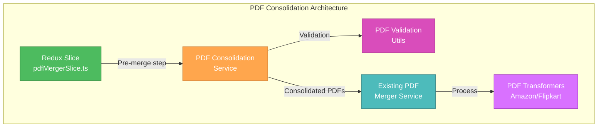
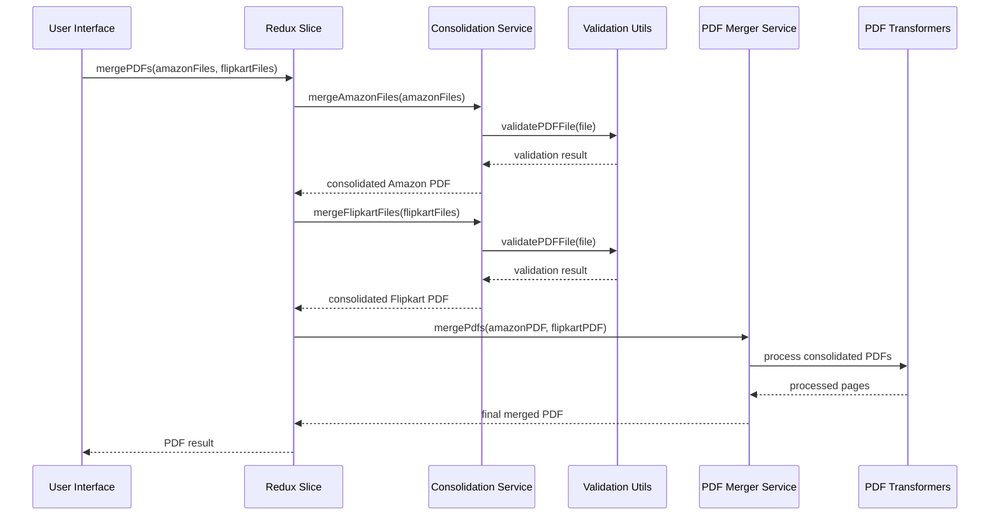
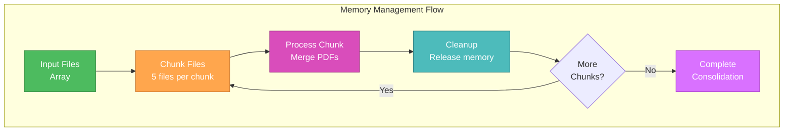

# 🎨🎨🎨 ENTERING CREATIVE PHASE: PDF CONSOLIDATION ARCHITECTURE 🎨🎨🎨

## Context
**System Requirements:**
- Merge multiple Amazon PDF files into a single consolidated PDF
- Merge multiple Flipkart PDF files into a single consolidated PDF
- Maintain backward compatibility with existing PDF processing workflow
- Handle large file sets efficiently without memory overflow
- Provide robust error handling for individual file failures

**Technical Constraints:**
- Must integrate with existing Redux slice (`pdfMergerSlice.ts`)
- Must preserve existing transformer functionality (`AmazonPDFTransformer`, `FlipkartPageTransformer`)
- Must use existing PDF libraries (`pdf-lib`, `pdfjs-dist`)
- Must maintain current API compatibility
- Must handle files up to 100MB+ in total size

## Component Analysis

### Core Components
- **PDFConsolidationService**: Primary service for merging PDF files by type
- **PDFValidationUtils**: Utility functions for PDF validation and error handling
- **Enhanced Redux Slice**: Updated `pdfMergerSlice.ts` with pre-merge functionality
- **Integration Layer**: Bridge between consolidation service and existing merger service

### Component Interactions
- Redux thunk calls consolidation service before existing processing
- Consolidation service validates and merges files by type
- Merged PDFs passed to existing `PDFMergerService`
- Existing transformers process consolidated PDFs as before

## Architecture Options

### Option 1: Direct PDF-Lib Consolidation
**Description**: Use pdf-lib directly to merge PDF files in memory, processing all files at once.

**Pros:**
- Simple implementation with direct pdf-lib API usage
- Fast processing for small to medium file sets
- Minimal code complexity
- Direct integration with existing pdf-lib usage

**Cons:**
- High memory usage for large file sets
- Risk of memory overflow with many files
- No progress tracking or cancellation support
- All-or-nothing approach (one failure breaks entire process)

**Technical Fit:** Medium
**Complexity:** Low
**Scalability:** Low

### Option 2: Streaming Chunked Consolidation
**Description**: Process PDF files in chunks, merging them incrementally with memory management.

**Pros:**
- Memory-efficient for large file sets
- Progress tracking capability
- Graceful error handling per chunk
- Scalable to handle hundreds of files
- Can implement cancellation support

**Cons:**
- More complex implementation
- Slightly slower due to chunking overhead
- Requires careful memory management
- More error handling complexity

**Technical Fit:** High
**Complexity:** Medium
**Scalability:** High

### Option 3: Worker-Based Parallel Consolidation
**Description**: Use Web Workers to process PDF consolidation in parallel threads.

**Pros:**
- Parallel processing for faster consolidation
- Non-blocking UI during processing
- Can handle very large file sets
- Excellent user experience with progress updates

**Cons:**
- Complex implementation with worker communication
- Browser compatibility considerations
- Memory usage still needs management
- More complex error handling across workers

**Technical Fit:** Medium
**Complexity:** High
**Scalability:** High

## Decision

**Chosen Option: Option 2 - Streaming Chunked Consolidation**

**Rationale:**
1. **Memory Efficiency**: Critical for handling large file sets without browser crashes
2. **Scalability**: Can handle hundreds of files without performance degradation
3. **Error Resilience**: Individual file failures don't break the entire process
4. **User Experience**: Progress tracking provides better feedback
5. **Implementation Complexity**: Balanced approach between simplicity and functionality

**Implementation Considerations:**
- Implement configurable chunk sizes (default: 5 files per chunk)
- Add progress callbacks for UI feedback
- Implement retry logic for failed chunks
- Add memory usage monitoring
- Provide cancellation support for long-running operations

## Architecture Design

### Component Structure


### Data Flow


### Memory Management Strategy


## Implementation Guidelines

### PDFConsolidationService Interface
```typescript
interface PDFConsolidationService {
  // Main consolidation methods
  mergeAmazonFiles(
    files: Uint8Array[], 
    options?: ConsolidationOptions
  ): Promise<Uint8Array | null>;
  
  mergeFlipkartFiles(
    files: Uint8Array[], 
    options?: ConsolidationOptions
  ): Promise<Uint8Array | null>;
  
  // Progress tracking
  onProgress?: (progress: ConsolidationProgress) => void;
  
  // Cancellation support
  cancel(): void;
}

interface ConsolidationOptions {
  chunkSize?: number; // Default: 5
  validateFiles?: boolean; // Default: true
  retryAttempts?: number; // Default: 3
  memoryThreshold?: number; // Default: 50MB
}

interface ConsolidationProgress {
  currentChunk: number;
  totalChunks: number;
  currentFile: number;
  totalFiles: number;
  percentage: number;
  memoryUsage: number;
}
```

### Error Handling Strategy
```typescript
interface ConsolidationError extends Error {
  type: 'VALIDATION_ERROR' | 'MERGE_ERROR' | 'MEMORY_ERROR' | 'CANCELLATION_ERROR';
  fileIndex?: number;
  chunkIndex?: number;
  retryCount?: number;
}

// Error handling approach:
// 1. Individual file validation errors: Skip file, continue processing
// 2. Chunk merge errors: Retry with smaller chunk size
// 3. Memory errors: Reduce chunk size and retry
// 4. Cancellation: Clean up resources and return null
```

## Validation

### Requirements Met
- [✓] Amazon files consolidation requirement
- [✓] Flipkart files consolidation requirement  
- [✓] Backward compatibility requirement
- [✓] Large file set handling requirement
- [✓] Error handling requirement

### Technical Feasibility
- **High**: All required libraries are available and well-documented
- **pdf-lib** provides robust PDF merging capabilities
- **Memory management** can be implemented with chunking
- **Error handling** can be implemented with try-catch and retry logic

### Risk Assessment
- **Low Risk**: Integration with existing Redux slice
- **Medium Risk**: Memory management with very large files
- **Low Risk**: PDF compatibility issues
- **Medium Risk**: Performance impact of chunking overhead

## Performance Considerations

### Memory Usage Optimization
- **Chunk Size**: Configurable (default 5 files) to balance memory vs performance
- **Garbage Collection**: Explicit cleanup after each chunk
- **Memory Monitoring**: Track usage and reduce chunk size if needed
- **Streaming**: Process files as they're loaded rather than loading all at once

### Processing Time Optimization
- **Parallel Validation**: Validate files in parallel within chunks
- **Efficient Merging**: Use pdf-lib's optimized merging methods
- **Progress Tracking**: Provide real-time feedback to users
- **Cancellation Support**: Allow users to cancel long-running operations

🎨 CREATIVE CHECKPOINT: Architecture design complete with streaming chunked consolidation approach

## Integration Points

### Redux Slice Integration
```typescript
// Updated mergePDFs thunk workflow:
export const mergePDFs = createAsyncThunk(
  'pdfMerger/mergePDFs',
  async (params: MergePDFsParams) => {
    const { amazonFiles, flipkartFiles, sortConfig, selectedDate } = params;
    
    // Step 1: Consolidate Amazon files
    const consolidationService = new PDFConsolidationService();
    const consolidatedAmazonPDF = await consolidationService.mergeAmazonFiles(
      await Promise.all(amazonFiles.map(file => readFileFromInput(file)))
    );
    
    // Step 2: Consolidate Flipkart files  
    const consolidatedFlipkartPDF = await consolidationService.mergeFlipkartFiles(
      await Promise.all(flipkartFiles.map(file => readFileFromInput(file)))
    );
    
    // Step 3: Process with existing merger service
    const mergePdfs = new PDFMergerService(products, categories);
    const pdf = await mergePdfs.mergePdfs({
      amzon: consolidatedAmazonPDF ? [consolidatedAmazonPDF] : [],
      flp: consolidatedFlipkartPDF ? [consolidatedFlipkartPDF] : [],
      sortConfig,
      selectedDate
    });
    
    // Rest of existing logic...
  }
);
```

### Service Layer Integration
```typescript
// Updated PDFMergerService to accept consolidated PDFs
public async mergePdfs({
  amzon,
  flp,
  sortConfig,
  selectedDate
}: {
  amzon: Uint8Array[]; // Now expects consolidated PDFs
  flp: Uint8Array[];   // Now expects consolidated PDFs
  sortConfig?: CategorySortConfig;
  selectedDate?: Date;
}): Promise<PDFDocument | undefined> {
  // Existing logic remains the same
  // Transformers will process consolidated PDFs
}
```

🎨🎨🎨 EXITING CREATIVE PHASE - DECISION MADE 🎨🎨🎨

**Architecture Decision**: Streaming Chunked Consolidation with configurable chunk sizes, progress tracking, and robust error handling. This approach provides the optimal balance of memory efficiency, scalability, and user experience while maintaining full backward compatibility with existing functionality. 